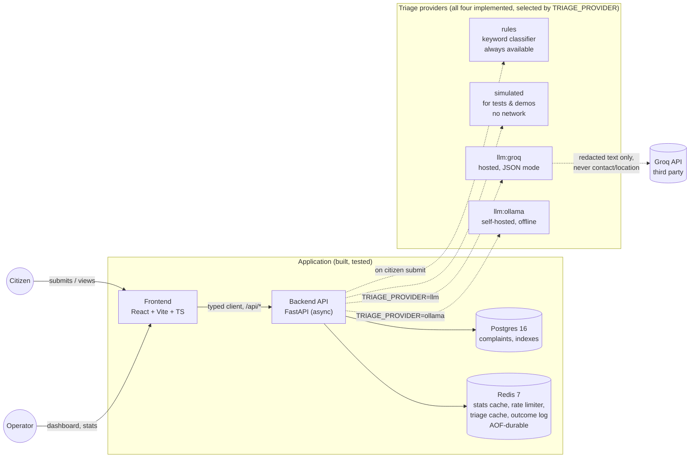

# CivicPulse

[](https://github.com/ibrahimshaykh/civicpulse/actions/workflows/ci.yml)


Municipal complaint triage for CS4032 Software Construction and Design,
Assignment 01. A citizen reports a problem in free text; an LLM classifies
it by category and priority, with a deterministic rule-based fallback, so
a burst water main never waits behind three streetlight reports.

**Project status:** see [STATUS.md](STATUS.md) for live progress and
marks secured so far. **Full plan:**
[docs/IMPLEMENTATION_PLAN.md](docs/IMPLEMENTATION_PLAN.md).

## Architecture



**What's real vs. what's planned:** the application above — frontend,
backend, Postgres, Redis, and all four triage providers — is implemented
and tested. The backend already runs in a real Docker image
(`backend/Dockerfile`), and the data tier (Postgres + Redis, on a sealed
internal Docker network with Redis AOF on a named volume) runs from
`compose.yaml` today. Wiring the backend and frontend *into* that same
compose file, a frontend Docker image, and the Kubernetes deployment
described in the full plan are still in progress — see [STATUS.md](STATUS.md)
for exactly what's done.

## Quickstart

**Today (verified in this repo):**

```bash
# Data tier (Postgres + Redis), real and Docker-based:
cp .env.example .env        # set POSTGRES_PASSWORD / REDIS_PASSWORD
docker compose up -d        # brings up database + cache only, for now

# Backend, run locally against them (point it at localhost, not the
# Docker-internal "database"/"cache" hostnames compose.yaml uses):
cd backend
uv sync
POSTGRES_HOST=localhost REDIS_HOST=localhost \
  POSTGRES_PASSWORD=<same value as .env> REDIS_PASSWORD=<same value as .env> \
  uv run alembic upgrade head
POSTGRES_HOST=localhost REDIS_HOST=localhost \
  POSTGRES_PASSWORD=<...> REDIS_PASSWORD=<...> \
  uv run python -m app.cli seed
POSTGRES_HOST=localhost REDIS_HOST=localhost \
  POSTGRES_PASSWORD=<...> REDIS_PASSWORD=<...> TRIAGE_PROVIDER=rules \
  uv run uvicorn app.main:create_app --factory --reload --port 8000

# Frontend, in a second terminal:
cd frontend
npm install
npm run dev
```

`TRIAGE_PROVIDER=rules` above needs no API key and no network at all — it's
the always-available fallback provider, so this is the fastest path to a
fully working app locally. Swap in `TRIAGE_PROVIDER=simulated` for
demo-realistic (but fake) LLM-style output, or `llm`/`ollama` once you
have a Groq key or a local Ollama model respectively (see
[docs/adr/0001-provider-interface.md](docs/adr/0001-provider-interface.md)
and `docs/TRIAGE.md` once it lands).

**Coming soon (`DK-04`, `FE-11`):** one command —
`docker compose up` — bringing up the entire stack, backend and frontend
included, with no manual host/env overrides. `data`'s `internal: true`
network currently has no ports published to the host on purpose (that's
the network-isolation rubric item), which is exactly why the backend
needs the `localhost` overrides above until it's wired in as its own
compose service on the same network.

## API

All ten endpoints the brief asks for (`docs/ENGINEERING-NOTES.md`'s
"Deviations" section explains the count): the nine below, plus
`/api/openapi.json` itself as the tenth, since the frontend's typed
client (`frontend/src/api/schema.d.ts`) is generated directly against it.

| Method | Path | Purpose |
|---|---|---|
| `POST` | `/api/complaints` | Submit a new complaint; triages it synchronously and returns the classified record |
| `GET` | `/api/complaints` | List complaints, filterable by category/priority/status, paginated |
| `GET` | `/api/complaints/{id}` | Fetch one complaint's full record |
| `PATCH` | `/api/complaints/{id}/status` | Transition a complaint's status (server enforces the allowed transitions; a 409 on a stale/invalid one) |
| `GET` | `/api/stats` | Aggregate counts by category/priority/status, Redis-cached (`X-Cache: HIT`/`MISS`) |
| `GET` | `/api/meta/providers` | Active triage provider, its model, the triage cache's measured hit rate, and the last 20 triage outcomes |
| `GET` | `/health` | Liveness: process is up |
| `GET` | `/ready` | Readiness: Postgres and Redis both reachable, reports which one failed by name if not |
| `GET` | `/metrics` | Prometheus text exposition (excluded from the OpenAPI schema on purpose — it isn't a JSON API) |
| `GET` | `/api/openapi.json` | The OpenAPI schema itself — the tenth endpoint, and what the frontend's client is generated from |

Interactive docs (Swagger UI) are served at `/api/docs` once the backend
is running.

## Screenshots

_TODO (human step, `DOC-01`): take screenshots of the Submit page, the
Dashboard with a filter applied, the Stats page showing `X-Cache: HIT`,
and the complaint detail page, then add them here. Test this quickstart
on a second machine before submission, per the brief's own requirement._

## Documentation index

- [docs/adr/](docs/adr/) — architecture decision records (0001 provider
  interface done; 0002 frontend runtime config, 0003 deploy-by-SHA, 0004
  PII and data governance — see the folder for current status)
- [docs/ENGINEERING-NOTES.md](docs/ENGINEERING-NOTES.md) — the brief's
  eight required engineering questions, merge conflict, indexes, AOF,
  and deviations from the brief
- [docs/AI-USAGE.md](docs/AI-USAGE.md) — what AI tooling was used for,
  what was accepted, and what was rejected or corrected and why
- [docs/IMPLEMENTATION_PLAN.md](docs/IMPLEMENTATION_PLAN.md) — the full
  task-by-task implementation plan this project follows
- `docs/RUNBOOK.md`, `docs/TRIAGE.md` — not written yet (`DOC-06`, `DOC-09`)

## Updating the status page

After finishing a task, set its status in `docs/progress.toml`, then run:

    python scripts/update_status.py

Commit `docs/progress.toml` and `STATUS.md` together with the task's
work. CI fails if they're out of sync.
