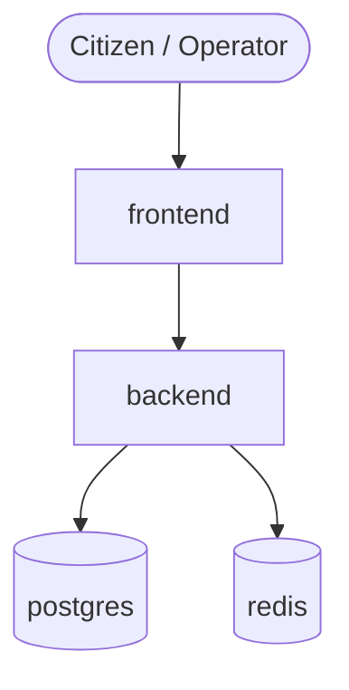

# CivicPulse

Municipal complaint triage platform.


## Quickstart
```bash
make up
```
Open `http://localhost:8080`.

## API
| Method | Path | Behaviour |
|---|---|---|
| POST | /api/complaints | Create complaint |
| GET | /api/complaints | List complaints |
| PATCH | /api/complaints/{id}/status | Update status |
| GET | /api/stats | View stats |
| GET | /api/meta/providers | Providers info |
| GET | /health | Liveness |
| GET | /ready | Readiness |
| GET | /metrics | Prometheus |

## Architecture

